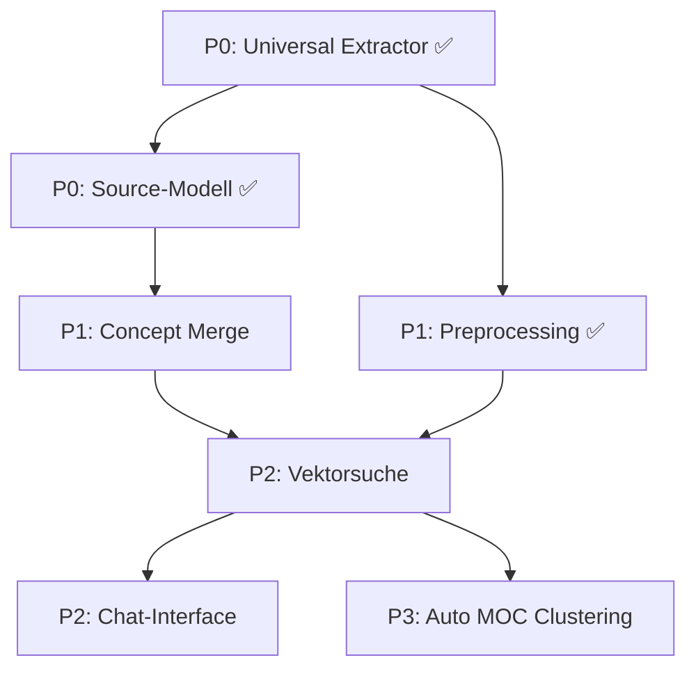

# Roadmap-Übersicht: ebook-ingest

> Abgeleitet aus der ChatGPT-Konversation: Personal Knowledge Engine für Obsidian Vaults.

---

## Status: Ist-Zustand (2026-07-05)

| Komponente | Status |
|---|---|
| EPUB-Extraktion | ✅ Fertig |
| LLM-Analyse (Ollama) | ✅ Fertig |
| Concept Registry | ✅ Fertig |
| Obsidian Writer | ✅ Fertig |
| Pipeline | ✅ Fertig |
| CLI (mit --resume, --config) | ✅ Fertig |
| PDF-Extraktion | ✅ Fertig (P0) |
| HTML/URL-Extraktion | ✅ Fertig (P0) |
| Universal Extractor | ✅ Fertig (P0) |
| Source-Modell (Book→Source) | ✅ Fertig (P0) |
| Vault-Migration (v2→v3) | ✅ Fertig (P0) |
| Preprocessing Layer | ✅ Fertig (P1) |
| Concept Merging | ❌ Fehlt |
| Vektorsuche | ❌ Fehlt |
| Chat-Interface | ❌ Fehlt |
| Auto MOCs | ❌ Fehlt |

---

## Prioritäten und Abhängigkeiten



---

## Zeitplan

| Priorität | Feature | Geschätzt | Status |
|---|---|---|---|
| 🔴 **P0** | Universal Extractor | ~7 h | ✅ Fertig |
| 🔴 **P0** | Source-Modell | ~5,5 h | ✅ Fertig |
| 🟡 **P1** | Concept Merge Engine | ~9 h | ❌ Offen |
| 🟡 **P1** | Preprocessing Layer | ~8,5 h | ✅ Fertig |
| 🟢 **P2** | Vektorsuche + Embeddings | ~9 h | ❌ Offen |
| 🟢 **P2** | Chat-Interface | ~9,5 h | ❌ Offen |
| 🔵 **P3** | Auto MOC Clustering | ~8 h | ❌ Offen |

**Erledigt: ~21 h | Verbleibend: ~35,5 h**

---

## Architektur-Zielbild (nach allen Tasks)

```
ebook-ingest/
├── src/
│   ├── cli.ts                    # CLI (ingest + migrate)
│   ├── config.ts                 # Zentrale Konfiguration
│   ├── index.ts                  # Public API
│   │
│   ├── epub-extractor.ts         # EPUB → Text
│   ├── pdf-extractor.ts          # PDF → Text         ✅ (P0)
│   ├── html-extractor.ts         # HTML/URL → Text    ✅ (P0)
│   ├── universal-extractor.ts    # Factory             ✅ (P0)
│   ├── text-preprocessor.ts      # Cleaning            ✅ (P1)
│   │
│   ├── llm-analyzer.ts           # Ollama Analyse
│   ├── embedding-generator.ts    # Ollama Embeddings   (P2)
│   ├── prompt-templates.ts       # Chat Prompt Styles  (P2)
│   │
│   ├── concept-normalizer.ts     # Name → Filename
│   ├── concept-merge-engine.ts   # Duplikat-Merging    (P1)
│   ├── registry-manager.ts       # JSON-Registries
│   ├── knowledge-store.ts        # Source + Concept Store ✅ (P0)
│   │
│   ├── obsidian-writer.ts        # Markdown schreiben  ✅ (P0)
│   ├── vector-store.ts           # ChromaDB Client     (P2)
│   ├── knowledge-search.ts       # Semantische Suche   (P2)
│   ├── chat-engine.ts            # RAG Chat            (P2)
│   ├── moc-generator.ts          # Auto MOCs           (P3)
│   │
│   ├── pipeline.ts               # Haupt-Pipeline
│   └── migrate-vault.ts          # v2→v3 Migration     ✅ (P0)
│
└── tests/
    ├── epub-extractor.test.ts
    ├── pdf-extractor.test.ts      ✅ (P0)
    ├── html-extractor.test.ts     ✅ (P0)
    ├── universal-extractor.test.ts ✅ (P0)
    ├── text-preprocessor.test.ts  ✅ (P1)
    ├── concept-merge-engine.test.ts (P1)
    ├── embedding-generator.test.ts (P2)
    ├── vector-store.test.ts       (P2)
    ├── chat-engine.test.ts        (P2)
    ├── moc-generator.test.ts      (P3)
    ├── knowledge-store.test.ts    ✅ (P0)
    └── migrate-vault.test.ts      ✅ (P0)
    └── fixtures/                  ✅ (P0)
```

---

## Wichtige Architektur-Prinzipien

1. **Nicht neue Pipelines — nur neue Extractors.** LLM, Writer, Registry bleiben gleich.
2. **Abwärtskompatibilität.** Alte Methoden werden als deprecated-Wrapper behalten.
3. **Graceful Degradation.** Wenn ChromaDB oder Ollama nicht verfügbar sind, crasht nichts.
4. **TypeScript-first.** Alle Interfaces vor der Implementierung definieren.
5. **Tests für jede neue Datei.** Kein Code ohne Test.
